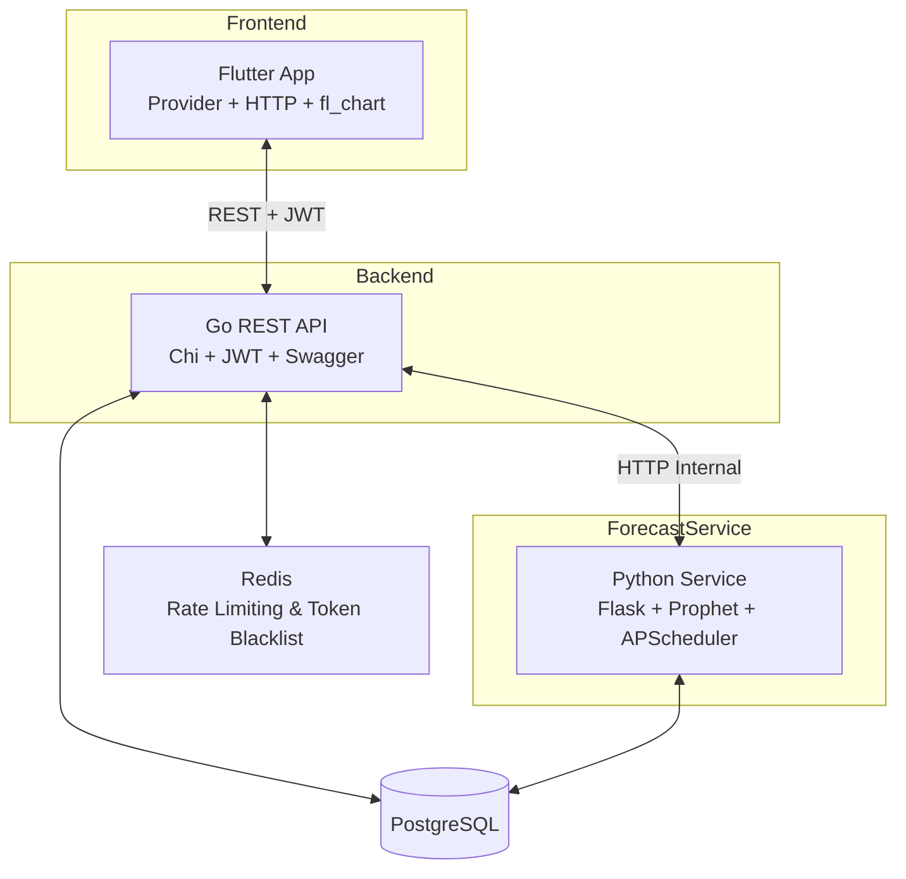

# 🏪 Sora Finance

**Sistem Manajemen Toko & POS + Forecasting Penjualan, Pengunjung & Stok**

---

## Ringkasan Project

Sora Finance adalah platform manajemen toko lengkap yang dirancang untuk membantu pemilik usaha retail dan F&B dalam mengelola operasional sehari-hari secara terpusat — mulai dari pencatatan order, pembayaran, laporan keuangan, hingga prediksi penjualan berbasis data.

**Pengguna utama:** Pemilik toko, manajer, kasir, dan admin.

**Masalah yang diselesaikan:**
- Pengelolaan multi-toko dalam satu sistem
- Pencatatan transaksi real-time (POS)
- Laporan keuangan harian dan bulanan otomatis
- Prediksi penjualan, pengunjung, dan stok bahan baku menggunakan model Prophet

---

## Arsitektur Sistem



- **Frontend** berkomunikasi dengan **Backend** via REST API menggunakan JWT sebagai autentikasi.
- **Backend** menghubungi **Forecast Service** secara internal (tidak di-expose ke publik).
- Semua service mengakses **PostgreSQL** sebagai sumber data utama.
- **Redis** digunakan untuk rate limiting dan akan mendukung token blacklist di fase berikutnya.

---

## Tech Stack

### Frontend
| Teknologi | Versi / Keterangan |
|---|---|
| Flutter | Dart SDK ^3.11.5 |
| Provider | State management |
| http | HTTP client |
| fl_chart | Grafik & chart |
| shared_preferences | Penyimpanan lokal |
| google_fonts | Tipografi |

### Backend
| Teknologi | Versi / Keterangan |
|---|---|
| Go | 1.25 |
| Chi Router | HTTP router |
| pgx | PostgreSQL driver |
| go-redis | Redis client |
| JWT | Autentikasi |
| Swagger | Dokumentasi API |
| godotenv | Environment config |

### Forecast Service
| Teknologi | Versi / Keterangan |
|---|---|
| Python | 3.10+ |
| Flask | Web framework |
| Prophet | Model forecasting |
| pandas / numpy | Manipulasi data |
| APScheduler | Scheduler job otomatis |
| psycopg2-binary | PostgreSQL driver |

### Database & Infrastructure
| Komponen | Keterangan |
|---|---|
| PostgreSQL | 15+ — Database utama |
| Redis | Rate limiting & token blacklist (opsional) |
| Docker | Akan ditambahkan |

---

## Struktur Repository

```
sora-finance/
├── frontend/                          # Flutter App (client/UI)
├── backend/                           # Go REST API
├── forecast-service/                  # Python Forecasting Service
├── .gitignore
└── README.md
```

### Struktur Frontend (ringkas)

```
frontend/
├── lib/
│   ├── core/
│   │   └── constants/
│   │       └── api_constants.dart     # Konfigurasi BASE_URL API
│   ├── pages/                         # Halaman per modul
│   └── main.dart
├── pubspec.yaml
└── .env.example                       # [jika tersedia]
```

### Struktur Backend (ringkas)

```
backend/
├── cmd/
│   └── api/
│       └── main.go                    # Entry point
├── internal/                          # Handler, middleware, model, repository
├── .env.example
├── go.mod
└── go.sum
```

### Struktur Forecast Service (ringkas)

```
forecast-service/
├── app.py                             # Entry point Flask
├── models/                            # Hasil Output Forecast 
├── modules/                           # Logika Forecast
├── requirements.txt
└── .env.example
```

---

## Modul dan Fitur Utama

| Modul | Deskripsi |
|---|---|
| **Authentication** | Login, logout — dilindungi JWT + rate limiting |
| **Forecasting** | Prediksi penjualan, pengunjung, dan stok berbasis Prophet |
| **Dashboard** | Ringkasan keuangan real-time + chart forecast |

---

## Setup Environment

### Persyaratan Sistem

| Komponen | Versi Minimum |
|---|---|
| Flutter SDK | ^3.11.5 |
| Go | 1.25 |
| Python | 3.10+ |
| PostgreSQL | 15+ |
| Redis | Opsional (direkomendasikan untuk production) |
| Docker | Opsional (akan ditambahkan) |

---

### Clone Repository

```bash
git clone https://github.com/RajendraMaheswara/sora-finance.git
cd sora-finance
```

---

### Konfigurasi `.env`

**Backend** — salin dari `backend/.env.example`:

```env
SERVER_PORT=8080
DB_HOST=localhost
DB_PORT=5432
DB_USER=postgres
DB_PASSWORD=[isi sesuai konfigurasi project]
DB_NAME=sora_finance
DB_SSLMODE=disable
JWT_SECRET=[isi dengan string random min. 32 karakter]
ALLOWED_ORIGINS=http://localhost:3000,https://yourdomain.com
```

**Forecast Service** — salin dari `forecast-service/.env.example`:

```env
GOLANG_API_BASE_URL=http://localhost:8080/api
SERVICE_HOST=0.0.0.0
SERVICE_PORT=5000
DB_HOST=localhost
DB_PORT=5432
DB_USER=postgres
DB_PASSWORD=[isi sesuai konfigurasi project]
DB_NAME=sora_finance
DB_SSLMODE=disable
```

---

## Cara Menjalankan Project

### Frontend

```bash
# 1. Masuk ke folder frontend
cd frontend

# 2. Install dependency
flutter pub get

# 3. Setup konfigurasi API URL
cp lib/core/constants/api_constants.dart.example lib/core/constants/api_constants.dart
# Edit file tersebut, sesuaikan BASE_URL dengan alamat backend

# 4. Cek device yang tersedia (opsional)
flutter devices

# 5. Jalankan mode development
flutter run

# Jalankan di Chrome (web)
flutter run -d chrome

# 6. Jika terjadi error dependency
flutter clean
flutter pub get

# 7. Build production
flutter build web --release   # Web
flutter build apk --release   # Android APK
flutter build appbundle       # Android AAB (Play Store)
```

---

### Backend

```bash
# 1. Masuk ke folder backend
cd backend

# 2. Install dependency
go mod tidy

# 3. Setup environment
cp .env.example .env
# Edit .env sesuai konfigurasi lokal

# 4. Jalankan server lokal
go run ./cmd/api/

```

---

### Forecast Service

```bash
# 1. Masuk ke folder forecast service
cd forecast-service

# 2. Buat virtual environment
python -m venv venv

# 3. Aktifkan virtual environment
source venv/bin/activate        # Linux/macOS
# venv\Scripts\activate         # Windows

# 4. Install requirements
pip install -r requirements.txt

# Alternatif jika belum ada requirements.txt
pip install flask pandas numpy scikit-learn prophet psycopg2-binary apscheduler

# 5. Setup environment
cp .env.example .env
# Edit .env sesuai konfigurasi

# 6. Jalankan service
python app.py

# 7. Training ulang model (opsional)
# Gunakan endpoint /train atau biarkan APScheduler berjalan otomatis sesuai jadwal
```

---

## Common Commands

Referensi cepat perintah yang sering digunakan selama development.

### Flutter
```bash
flutter pub get          # Install dependency
flutter clean            # Bersihkan build cache
flutter run              # Jalankan di device/emulator
flutter run -d chrome    # Jalankan di browser
flutter devices          # Cek device yang tersedia
flutter build apk        # Build APK Android
flutter build web        # Build Web
```

### Go (Backend)
```bash
go mod tidy              # Install & bersihkan dependency
go run cmd/api/main.go   # Jalankan server
go build -o bin/api .    # Build binary
go test ./...            # Jalankan semua test
```

### Python (Forecast)
```bash
source venv/bin/activate            # Aktifkan virtual environment
pip install -r requirements.txt     # Install dependency
python app.py                       # Jalankan service
```

---

## Database

Database utama menggunakan **PostgreSQL 17.6**

**Tabel penting (berdasarkan modul yang tersedia):**

| Tabel | Deskripsi |
|---|---|
| `users` / `auth` | Data pengguna dan autentikasi |
| `stores` | Data toko dan jam operasional |
| `menus` / `products` | Menu, varian, dan bahan baku |
| `orders` / `order_items` | Transaksi order dan detailnya |
| `sales_summary` | Ringkasan penjualan harian/bulanan |
| `ingredients` / `stocks` | Bahan baku dan riwayat stok |
| `forecast_results` | Hasil prediksi dari forecast service |

> Untuk detail relasi antar tabel, lihat file dump SQL atau dokumentasi Swagger.

---

## API Documentation

Swagger UI tersedia saat backend berjalan:

```
http://localhost:8080/swagger/index.html
```

### Public / Auth

| Method | Endpoint | Auth | Deskripsi |
|---|---|---|---|
| POST | `/api/auth/login` | Public | Login user, rate limited |
| GET | `/api/auth/me` | JWT | Ambil profil user aktif |
| GET | `/health` | Public | Health check service |

### Internal / Protected

| Method | Endpoint | Auth | Deskripsi |
|---|---|---|---|
| GET | `/api/stores` | JWT | Daftar toko |
| GET/POST/PUT/DELETE | `/api/menu*` | JWT | CRUD menu & produk |
| GET | `/api/dashboard/forecast` | JWT | Data forecast untuk dashboard |

### Forecast

| Method | Endpoint | Auth | Deskripsi |
|---|---|---|---|
| GET | `/api/forecast/*` | Internal | Prediksi & hasil forecasting |
| POST | `/train` | Internal | Trigger training ulang model |

> Endpoint lengkap dan payload detail tersedia di Swagger UI.

---
