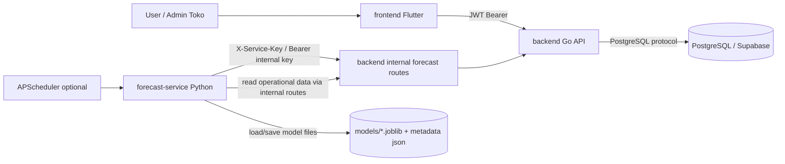
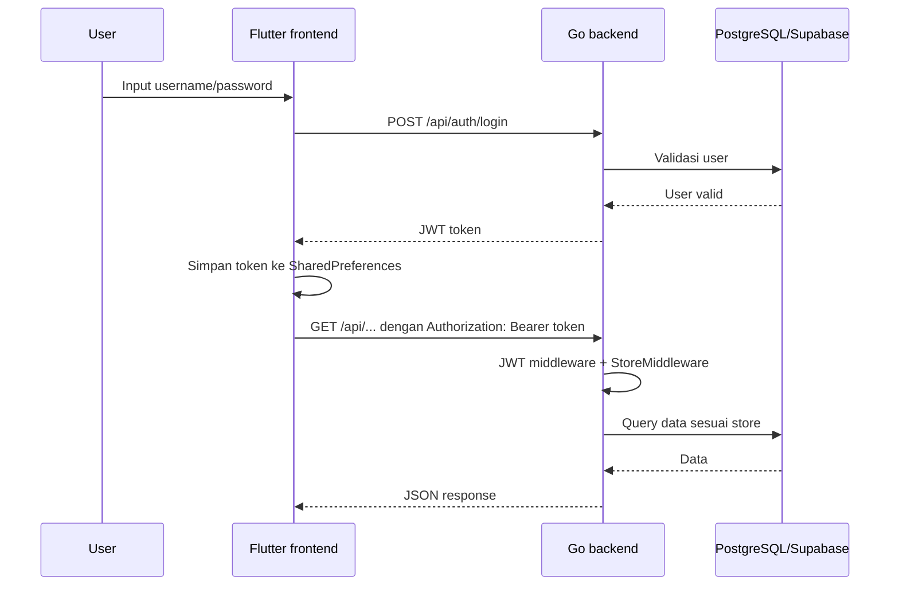
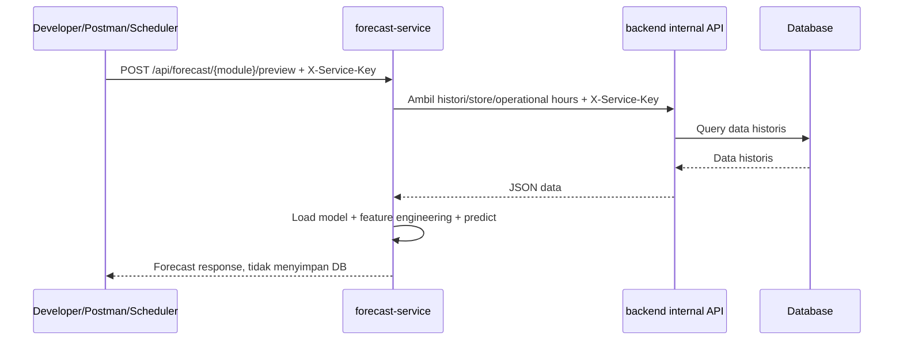
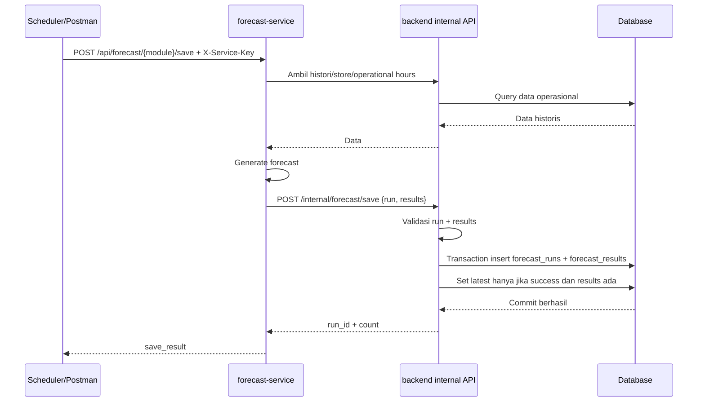

# Sora Finance — Dokumentasi Developer Lanjutan

Dokumen ini dibuat untuk developer berikutnya yang akan melanjutkan project **Sora Finance** dari repository `sora-finance-v1.5.zip`.

> **Catatan audit yang tidak boleh dilewatkan:** zip yang dianalisis masih berisi file `.env` asli, model `.joblib`, cache `__pycache__`, `.dart_tool`, dan binary `backend/api.exe`. Untuk repository final, file seperti itu sebaiknya tidak di-commit. Simpan hanya `.env.example`, source code, migration, dan dokumentasi.

## 1. Ringkasan project

Sora Finance adalah aplikasi POS/finance dan forecasting untuk toko/outlet. Project terdiri dari tiga service utama:

| Folder | Peran | Stack utama |
|---|---|---|
| `frontend/` | UI dashboard, login, list data master, histori transaksi, dan halaman forecast | Flutter/Dart |
| `backend/` | API utama, auth, store scoping, gateway database, internal write forecast | Go, `go-chi`, PostgreSQL/Supabase |
| `forecast-service/` | Service prediksi visitors, sales, inventory; retrain model; scheduler forecast | Python Flask, scikit-learn, Prophet, APScheduler |

Fokus bisnis utama project adalah membuat forecast untuk tiga modul:

1. **Visitors forecast**: prediksi jumlah pengunjung/transaksi.
2. **Sales forecast**: prediksi omzet/penjualan.
3. **Inventory forecast**: prediksi pemakaian bahan baku/ingredient.

Source of truth data forecast diarahkan ke dua tabel:

- `forecast_runs`: header/run forecast, metadata model, metrics, status, latest flag.
- `forecast_results`: detail prediksi per tanggal/periode dan per item jika ada.

Tabel lama seperti `forecast_predictions` sebaiknya dianggap legacy/deprecated bila masih ditemukan di branch lain.

## 2. Gambaran arsitektur



Prinsip keamanan utamanya:

- Frontend memakai JWT user biasa.
- Frontend **tidak boleh** membuat atau menimpa `forecast_runs` dan `forecast_results`.
- Forecast-service memakai `INTERNAL_SERVICE_KEY` untuk route internal backend.
- Backend menjadi satu-satunya gateway write forecast ke database.

## 3. Alur sistem utama

### 3.1 Login dan akses data dashboard



### 3.2 Forecast preview



### 3.3 Forecast save



## 4. Struktur repository tingkat atas

```text
sora-finance/
├── frontend/          # Flutter UI
├── backend/           # Go REST API + migrations + Swagger
└── forecast-service/  # Python ML forecasting service
```

Dokumentasi detail per folder tersedia di:

- [`frontend/README.md`](frontend/README.md)
- [`backend/README.md`](backend/README.md)
- [`forecast-service/README.md`](forecast-service/README.md)

## 5. Kontrak forecast standar

### 5.1 Request body standar

Untuk visitors dan sales:

```json
{
  "store_id": "<uuid-store>",
  "horizon_label": "daily",
  "horizon_count": 30
}
```

Untuk inventory single ingredient:

```json
{
  "store_id": "<uuid-store>",
  "ingredient_id": "<uuid-ingredient>",
  "horizon_label": "weekly",
  "horizon_count": 4
}
```

Untuk inventory semua ingredient di satu store:

```json
{
  "store_id": "<uuid-store>",
  "horizon_label": "daily",
  "horizon_count": 30
}
```

Makna `horizon_count`:

| `horizon_label` | Makna `horizon_count` |
|---|---|
| `daily` | jumlah hari |
| `weekly` | jumlah minggu |
| `monthly` | jumlah bulan |

`start_date` opsional. Bila tidak dikirim, forecast-service memakai start date otomatis berdasarkan complete operational period.

### 5.2 Endpoint forecast-service aktif

| Modul | Preview | Save | Retrain |
|---|---|---|---|
| Visitors | `POST /api/forecast/visitors/preview` | `POST /api/forecast/visitors/save` | `POST /api/forecast/visitors/retrain` |
| Sales | `POST /api/forecast/sales/preview` | `POST /api/forecast/sales/save` | `POST /api/forecast/sales/retrain` |
| Inventory | `POST /api/forecast/inventory/preview` | `POST /api/forecast/inventory/save` | `POST /api/forecast/inventory/retrain` |

Inventory retrain bersifat asynchronous dan memiliki status endpoint:

```text
GET /api/forecast/inventory/retrain/status/{task_id}
```

Endpoint `/api/forecast/{module}/run` tidak dijadikan endpoint utama. Untuk generate + save, gunakan `/save`.

### 5.3 Backend internal forecast routes aktual

Di kode backend v1.5, route internal berada di prefix:

```text
/internal/forecast
```

Route penting:

```text
POST /internal/forecast/save
POST /internal/forecast/forecast-runs
POST /internal/forecast/forecast-results
GET  /internal/forecast/visitors-daily-history
GET  /internal/forecast/stores
GET  /internal/forecast/orders
GET  /internal/forecast/order-items
GET  /internal/forecast/food-ingredients
GET  /internal/forecast/ingredient-stock-histories
GET  /internal/forecast/sales-daily-summaries
GET  /internal/forecast/sales-monthly-summaries
GET  /internal/forecast/store-operational-hours
```

Route internal dilindungi `ServiceKeyMiddleware` dan menerima header:

```http
X-Service-Key: <INTERNAL_SERVICE_KEY>
```

atau:

```http
Authorization: Bearer <INTERNAL_SERVICE_KEY>
```

## 6. Database forecast

### 6.1 `forecast_runs`

Mewakili satu proses forecast. Kolom utama:

- `store_id`
- `forecast_type`: `visitors`, `sales`, `inventory`
- `horizon_label`: `daily`, `weekly`, `monthly`
- `horizon_days`
- `granularity`
- `model_name`, `model_version`, `feature_version`
- `train_start_date`, `train_end_date`
- `predict_start_date`, `predict_end_date`
- `metrics`, `summary`, `data_quality`
- `status`: `success`, `failed`, `running`
- `is_latest`
- `started_at`, `finished_at`, `created_at`

Aturan integritas:

- `is_latest=true` hanya untuk `status='success'`.
- Run success tidak boleh menjadi latest jika tidak punya `forecast_results`.
- Satu store + forecast_type + horizon_label hanya boleh punya satu latest.

### 6.2 `forecast_results`

Mewakili detail prediksi dari sebuah run:

- `run_id`
- `target_date`
- `predicted_value`
- `lower_bound`, `upper_bound`
- `confidence_level`
- `actual_value`
- `item_id`
- `item_type`

Untuk inventory:

- `item_id = ingredient_id`
- `item_type = ingredient`

Untuk sales:

- `item_type = sales`
- `item_id` boleh kosong/null bila aggregate store.

Untuk visitors:

- `item_type = visitors` atau kosong sesuai hasil lama.
- `item_id` biasanya kosong/null.

## 7. Cara menjalankan lokal

### 7.1 Backend

```bash
cd backend
cp .env.example .env
# edit DB_HOST, DB_PORT, DB_USER, DB_PASSWORD, DB_NAME, JWT_SECRET, INTERNAL_SERVICE_KEY
go mod download
go run ./cmd/api
```

Health check:

```bash
curl http://localhost:8080/health
```

Swagger bila `ENABLE_SWAGGER=true`:

```text
http://localhost:8080/swagger/index.html
```

### 7.2 Forecast-service

```bash
cd forecast-service
python -m venv venv
source venv/bin/activate  # Windows: venv\Scripts\activate
pip install -r requirements.txt
cp .env.example .env
# pastikan BACKEND_API_URL=http://localhost:8080/internal/forecast
# pastikan INTERNAL_SERVICE_KEY sama dengan backend
python app.py
```

Health check:

```bash
curl http://localhost:5000/health
```

### 7.3 Frontend

```bash
cd frontend
flutter clean
flutter pub get
flutter run -d chrome
```

Build web release:

```bash
flutter build web --release
```

Output build berada di:

```text
frontend/build/web
```

## 8. Environment variable penting

### Backend `.env`

```env
APP_ENV=development
SERVER_PORT=8080
DB_HOST=localhost
DB_PORT=5432
DB_USER=sora_app
DB_PASSWORD=change-me
DB_NAME=postgres
DB_SSLMODE=disable
JWT_SECRET=change-me-use-at-least-32-random-characters
REDIS_URL=
ALLOWED_ORIGINS=http://localhost:3000,http://localhost:5173
ENABLE_SWAGGER=true
ENABLE_TEST_ROUTES=false
INTERNAL_SERVICE_KEY=change-me
```

### Forecast-service `.env`

```env
SERVICE_HOST=0.0.0.0
SERVICE_PORT=5000
BACKEND_API_URL=http://localhost:8080/internal/forecast
GOLANG_API_BASE_URL=http://localhost:8080/internal/forecast
GOLANG_INTERNAL_API_BASE_URL=http://localhost:8080/internal/forecast
INTERNAL_SERVICE_KEY=change-me
BACKEND_REQUEST_TIMEOUT_SECONDS=30
FORECAST_MODE=manual
FORECAST_SCHEDULER_TIMEZONE=Asia/Jakarta
FORECAST_SCHEDULER_CHECK_INTERVAL_MINUTES=15
SCHEDULER_RETRAIN=true
```

## 9. Security checklist

- Hapus `.env` asli dari repo/zip final.
- Commit hanya `.env.example`.
- Pastikan `INTERNAL_SERVICE_KEY` backend dan forecast-service sama.
- Jangan expose `/internal/forecast/*` ke public internet tanpa reverse proxy/network control.
- Jangan beri frontend akses POST ke `forecast_runs` atau `forecast_results`.
- Batasi CORS production lewat `ALLOWED_ORIGINS`.
- Gunakan `JWT_SECRET` kuat minimal 32 karakter acak.
- Gunakan HTTPS di production/reverse proxy.
- Jangan simpan binary build (`api.exe`, `build/`, `.dart_tool/`, `__pycache__/`) di repository.

## 10. Testing minimum sebelum demo

### Backend forecast write

1. `POST /internal/forecast/save` tanpa service key → harus `401`.
2. `POST /internal/forecast/save` dengan service key salah → harus `401`.
3. `POST /internal/forecast/save` dengan `results=[]` → harus `400`.
4. Save forecast success valid → harus insert `forecast_runs` dan `forecast_results`.
5. Save forecast success baru untuk store/type/horizon sama → run lama `is_latest=false`.
6. Latest query hanya mengembalikan success run yang punya results.
7. Invalid UUID/date/json → harus `400`, bukan `500`.

### Forecast-service

Gunakan script:

```bash
cd forecast-service
python scripts/test_forecast_standard_endpoints.py \
  --base-url http://localhost:5000 \
  --service-key "$INTERNAL_SERVICE_KEY" \
  --store-id <uuid-store> \
  --ingredient-id <uuid-ingredient-optional>
```

Script mengecek preview/save untuk visitors, sales, inventory di daily/weekly/monthly, serta memastikan endpoint `/run` tidak aktif.

### Frontend

1. Login berhasil dengan credential valid.
2. Token tersimpan dan `/api/auth/me` berhasil.
3. Dashboard membuka data `forecast-results`, `sales-daily-summaries`, `ingredient-stock-histories`, dan `food-ingredients`.
4. Halaman visitor forecast menampilkan data visitors dari `forecast_results`.
5. Halaman sales forecast menampilkan data sales dari `forecast_results`.
6. Halaman stock forecast menghitung estimasi pemakaian inventory dari `forecast_results` dan stock history.
7. Logout membersihkan token dan kembali ke login.

## 11. Deployment Proxmox tanpa Docker

Rekomendasi untuk server RAM kecil:

- Backend dijalankan sebagai Go binary via `systemd`.
- Forecast-service dijalankan via Python virtualenv dan `systemd`.
- Frontend di-build sebagai static web dan disajikan oleh Nginx.
- Nginx menjadi reverse proxy ke backend dan forecast-service.
- Gunakan Tailscale/SSH untuk akses server internal bila perlu.

Contoh layout server:

```text
/opt/sora-finance/
├── backend/
│   ├── api
│   └── .env
├── forecast-service/
│   ├── venv/
│   ├── app.py
│   ├── models/
│   └── .env
└── frontend-web/
    └── index.html
```

## 12. Roadmap pengembangan lanjutan

### P0/P1 — Wajib sebelum demo serius

- Pastikan `.env` asli dan binary runtime tidak masuk repository.
- Samakan versi Go di `go.mod` dengan toolchain server/lokal. Saat zip dianalisis, `go.mod` memakai `go 1.25.0`; ini berisiko jika server belum punya toolchain tersebut.
- Pastikan semua save forecast memakai route atomik `/internal/forecast/save` bila memungkinkan.
- Pastikan route POST forecast write hanya internal-only.
- Pastikan latest forecast tidak bisa kosong dan tidak bisa berasal dari run failed/running.
- Pastikan Swagger hanya mendokumentasikan route yang benar-benar aktif.

### P2 — Stabilitas dan developer experience

- Tambah pagination/filter server-side untuk `GET /api/forecast-results` agar frontend tidak menarik 500 row mentah lalu filtering client-side terus-menerus.
- Buat environment-based API base URL di frontend, bukan hardcoded `http://localhost:8080/api`.
- Pisahkan response model frontend per module lebih rapi dan tambahkan unit test parser.
- Tambah CI minimal: Go test, Flutter analyze, Python smoke test.
- Tambah migration runner atau prosedur migrasi eksplisit.

### P3 — Production hardening

- Pindahkan model `.joblib` ke object storage atau volume persistent yang jelas.
- Pisahkan job retrain berat ke worker queue agar tidak membebani proses Flask.
- Tambah retry/backoff saat forecast-service menyimpan ke backend.
- Tambah observability: structured log, request ID, metrics endpoint.
- Tambah audit log untuk forecast run dan retrain.

## 13. Glosarium singkat

| Istilah | Arti |
|---|---|
| Preview | Generate forecast tanpa simpan DB |
| Save | Generate forecast lalu simpan ke DB |
| Retrain | Latih ulang model berdasarkan histori terbaru |
| Horizon label | Granularitas forecast: daily, weekly, monthly |
| Horizon count | Jumlah periode forecast |
| Horizon days | Jumlah hari yang disimpan backend untuk periode forecast |
| Complete period | Periode bisnis yang sudah selesai sehingga aman dipakai sebagai acuan forecast |
| Latest run | Run forecast sukses terbaru yang dipakai dashboard |
| Internal service key | Secret antar-service forecast-service ↔ backend |
