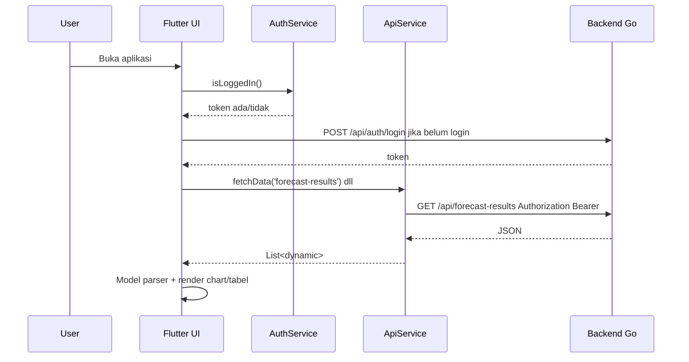

# Frontend — Dokumentasi Developer

Folder `frontend/` adalah aplikasi Flutter untuk UI Sora Finance: login, dashboard, data master, transaksi, histori stok, dan visualisasi forecast visitors/sales/inventory.

## 1. Stack

| Komponen | Teknologi |
|---|---|
| Framework | Flutter |
| Language | Dart |
| HTTP client | `http` |
| State/token storage | `shared_preferences` |
| Chart | `fl_chart` |
| Font | `google_fonts` |
| Target utama | Flutter web, dengan scaffold Android/iOS/Windows bawaan Flutter |

`pubspec.yaml` v1.5:

```yaml
name: sora2
version: 0.1.0+1
environment:
  sdk: ^3.11.5
dependencies:
  http: ^1.2.1
  provider: ^6.1.2
  google_fonts: ^6.2.1
  fl_chart: ^1.2.0
  shared_preferences: ^2.2.2
```

## 2. Struktur folder penting

```text
frontend/
├── lib/
│   ├── main.dart                         # Entry point Flutter, MaterialApp, SplashPage
│   ├── core/
│   │   ├── constants/
│   │   │   └── api_constants.dart        # Base URL backend
│   │   └── services/
│   │       ├── api_service.dart          # Generic GET list/detail dengan JWT
│   │       └── auth_service.dart         # Login, logout, token, /auth/me
│   ├── models/
│   │   ├── auth/                         # Login response dan /me model
│   │   ├── forecast_series_model.dart    # Parser forecast_results generic
│   │   ├── visitor_forecast_model.dart   # Model/loader forecast visitors
│   │   ├── sales_forecast_model.dart     # Model/loader forecast sales
│   │   ├── stock_forecast_model.dart     # Model forecast stok/inventory legacy+current
│   │   └── *_model.dart                  # Model data master/histori
│   ├── pages/
│   │   ├── auth/                         # LoginPage, SplashPage
│   │   ├── dashboard/                    # Dashboard utama
│   │   ├── visitor_forecast/             # Halaman forecast pengunjung
│   │   ├── sales_forecast/               # Halaman forecast sales
│   │   ├── stock_forecast/               # Halaman forecast stok
│   │   ├── orders/                       # List order
│   │   ├── food_ingredients/             # Master ingredient
│   │   ├── ingredient_stock/             # Histori stok
│   │   ├── customers/ stores/ users/     # Master data lain
│   │   └── sales_daily/ monthly_summaries/
│   └── widgets/
│       ├── forecast_chart.dart           # Komponen chart forecast + history + CI
│       └── sidebar.dart                  # Sidebar dan logout
├── web/                                  # Flutter web assets
├── android/ ios/ windows/                # Platform scaffold Flutter
├── pubspec.yaml
└── analysis_options.yaml
```

## 3. Entry point dan routing sederhana

`lib/main.dart`:

- Menjalankan `MyApp`.
- Menggunakan `MaterialApp` dengan `debugShowCheckedModeBanner=false`.
- Theme Material 3 dengan seed indigo.
- Home diarahkan ke `SplashPage`.

`SplashPage` mengecek token via `AuthService.isLoggedIn()`:

- Jika token ada → masuk ke halaman utama/dashboard.
- Jika tidak ada → masuk ke login.

Routing saat ini memakai `Navigator`/`MaterialPageRoute` manual, belum memakai router declarative seperti `go_router`.

## 4. Service layer frontend

### 4.1 API constants

File:

```text
lib/core/constants/api_constants.dart
```

File ini menyimpan konfigurasi URL backend utama. Menggunakan `String.fromEnvironment` agar URL dapat disuntikkan secara dinamis saat compile-time tanpa mengubah source code.

```dart
class ApiConstants {
  static const String baseUrl = String.fromEnvironment(
    'API_BASE_URL',
    defaultValue: 'http://localhost:8080/api',
  );
}
```

- Jika `API_BASE_URL` tidak didefinisikan (misal saat lokal development), service akan fallback ke `http://localhost:8080/api`.
- Untuk mengatur URL saat build (misal untuk production):

```bash
flutter build web --release --dart-define=API_BASE_URL=https://api-domain.com/api
```

### 4.2 AuthService

File:

```text
lib/core/services/auth_service.dart
```

Fungsi:

- `login(username, password)` → `POST /api/auth/login`, simpan `token` ke `SharedPreferences`.
- `logout()` → hapus `token` dan `current_user`.
- `getToken()` → baca token.
- `isLoggedIn()` → true jika token ada.
- `getCurrentUser()` → `GET /api/auth/me` dengan Bearer token.

Catatan pengembangan:

- Saat token expired, service belum otomatis redirect/logout global.
- Error login hanya boolean false, belum membawa detail pesan error.
- Header `/auth/me` belum menyertakan `Content-Type`; bukan masalah besar untuk GET, tapi bisa distandarkan.

### 4.3 ApiService

File:

```text
lib/core/services/api_service.dart
```

Fungsi:

- `_headers()` → menyusun `Content-Type` dan `Authorization: Bearer <token>`.
- `fetchData(endpoint)` → GET list dari `${baseUrl}/$endpoint`.
- `fetchDetail(endpoint, id)` → GET detail dari `${baseUrl}/$endpoint/$id`.

`fetchData()` cukup defensif:

- Bila response body `null`, return list kosong.
- Bila response body list, return list.
- Bila response body map dengan `data: []`, return `data`.
- Selain itu return list kosong.

Keterbatasan:

- Error detail dari backend tidak diteruskan ke UI.
- Belum ada timeout eksplisit.
- Belum ada retry/interceptor.
- Belum ada POST/PUT/DELETE generic.

## 5. Data flow UI



## 6. Halaman utama

### 6.1 Auth

```text
lib/pages/auth/login_page.dart
lib/pages/auth/splash_page.dart
```

Fungsi:

- Login form username/password.
- Pengecekan session sederhana.
- Redirect login ↔ dashboard.

### 6.2 Dashboard

```text
lib/pages/dashboard/dashboard_page.dart
```

Dashboard mengambil beberapa data sekaligus:

```text
forecast-results
sales-daily-summaries
ingredient-stock-histories
food-ingredients
```

Dashboard menampilkan ringkasan forecast dan histori. Perhitungan tren dilakukan di client dari data yang sudah ditarik.

### 6.3 Forecast visitors

```text
lib/pages/visitor_forecast/visitor_forecast_page.dart
lib/models/visitor_forecast_model.dart
```

Data utama:

```text
GET /api/forecast-results
GET /api/sales-daily-summaries
```

Model visitors memfilter `forecast_results` untuk jenis visitors lalu membentuk series forecast daily/weekly/monthly.

### 6.4 Forecast sales

```text
lib/pages/sales_forecast/sales_forecast_page.dart
lib/models/sales_forecast_model.dart
```

Data utama:

```text
GET /api/forecast-results
GET /api/sales-daily-summaries
```

Model sales membaca forecast dari `forecast_results`, bukan dari endpoint forecast-service langsung. Ini tepat untuk dashboard user karena user hanya membaca hasil forecast yang sudah tersimpan.

### 6.5 Forecast stock/inventory

```text
lib/pages/stock_forecast/stock_forecast_page.dart
lib/models/stock_forecast_model.dart
```

Data utama:

```text
GET /api/forecast-results
GET /api/ingredient-stock-histories
GET /api/food-ingredients
```

Halaman ini menghitung estimasi pemakaian, estimasi stok tersisa, dan potensi depletion berdasarkan forecast inventory per ingredient.

### 6.6 Data master dan history

Folder halaman:

```text
customers/
food_ingredients/
ingredient_stock/
monthly_summaries/
orders/
sales_daily/
stores/
users/
```

Pola umumnya:

1. Buat `ApiService`.
2. Panggil `fetchData(endpoint)` di `initState`.
3. Parse ke model.
4. Render table/list.

## 7. Model forecast frontend

### 7.1 `forecast_series_model.dart`

File ini penting karena menjembatani schema backend:

- `forecast_runs` sebagai metadata run.
- `forecast_results` sebagai detail series.

Fungsi utamanya:

- Parse baris `forecast_results`.
- Filter berdasarkan `item_type`/jenis forecast.
- Build series untuk chart.
- Deduplicate/normalize titik forecast.

### 7.2 `visitor_forecast_model.dart`

Membangun tampilan visitors dari hasil forecast tersimpan. Mendukung struktur response lama dan struktur `forecast_results`.

### 7.3 `sales_forecast_model.dart`

Membangun tampilan sales dari `forecast_results`. Jika belum ada forecast sales, UI mengembalikan empty state.

### 7.4 `stock_forecast_model.dart`

Masih punya komentar legacy terkait `forecast_predictions`, tetapi implementasi sudah menggunakan `forecast_results` sebagai sumber utama untuk item breakdown. Developer berikutnya sebaiknya membersihkan komentar/logic legacy agar tidak membingungkan.

## 8. Widget chart

File:

```text
lib/widgets/forecast_chart.dart
```

Fungsi:

- Menampilkan histori dan forecast dalam chart.
- Mendukung confidence interval (`lower_bound`, `upper_bound`).
- Menghitung trend percentage via helper `forecastTrendPct()`.
- Menangani label dan visualisasi ketika jumlah titik forecast sedikit/banyak.

Catatan pengembangan:

- File ini cukup besar. Jika makin kompleks, pisahkan menjadi komponen kecil: `ForecastLineChart`, `ForecastTooltip`, `ForecastLegend`, `ForecastSummaryCard`.

## 9. Cara menjalankan

```bash
cd frontend
flutter clean
flutter pub get
flutter run -d chrome --web-port=3000 
```

Build web:

```bash
flutter build web --release
```

Jika sudah memakai `--dart-define` untuk API URL:

```bash
flutter build web --release \
  --dart-define=API_BASE_URL=https://api-domain.com/api
```

## 10. Konvensi untuk developer berikutnya

- Jangan panggil forecast-service langsung dari frontend untuk user dashboard. Frontend cukup membaca hasil forecast dari backend. (Jika memang ingin memanggil forecast service langsung dari frontend untuk user dashboard, frontend harus menggunakan INTERNAL_SERVICE_KEY)
- Semua request frontend ke backend memakai JWT user.
- Bila butuh trigger forecast manual, buat admin/internal tool terpisah, bukan UI user biasa.
